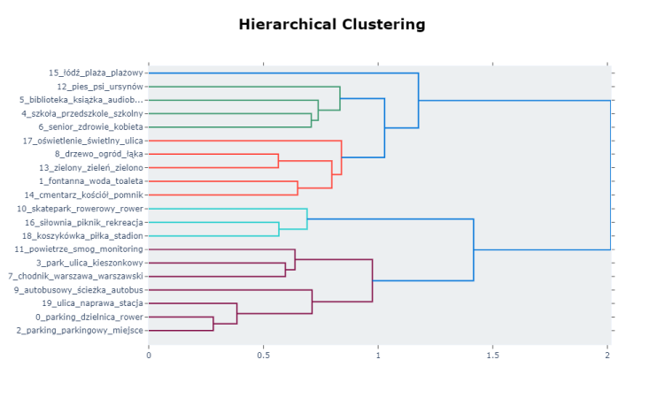
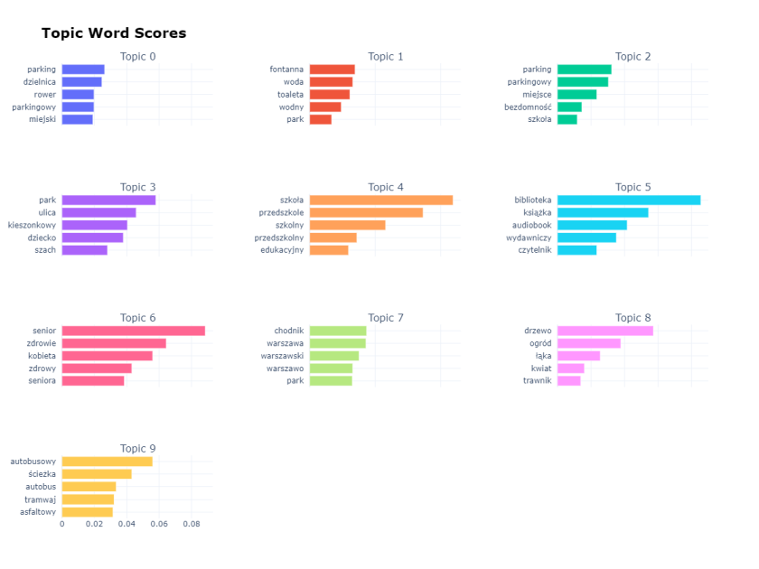
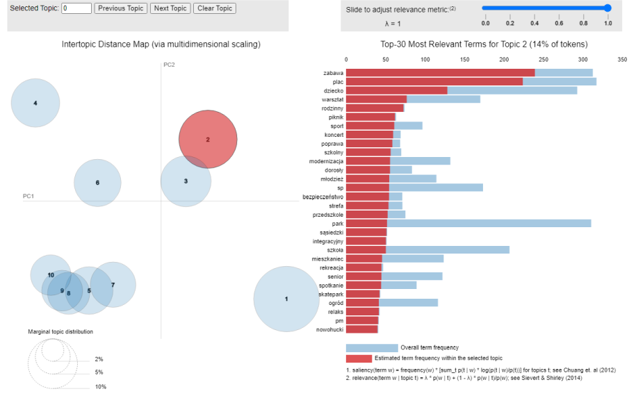
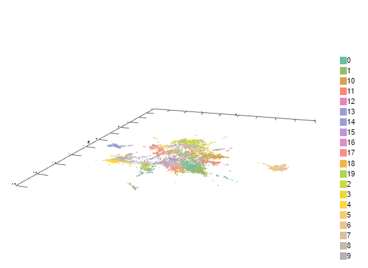
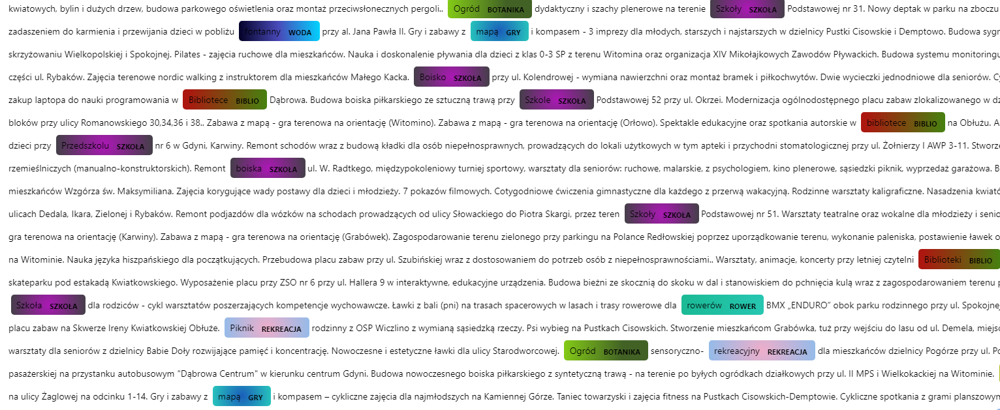
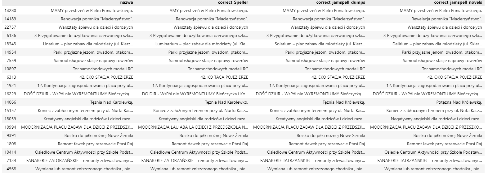

## Wstęp do projektu analizy językowej budżetów partycypacyjnych 
Dane z katalogu 'inputs' pochodzą od: https://github.com/maryanoo/NLP-ekolo

Realizacja w ramach projektu NLP grupy Warszawsko-Międzymiastowo-Międzynarodowej
https://github.com/DataWorkshop-Foundation/WMM-NLP-project

## 00_ideas_and_issues.ipynb
Wstępny notatnik obrazujący potencjalne możliwości analizy.
* Początkowa analiza tematów za pomocą UMAP i HDBSCAN

## 02_bertopic_colab.ipynb
Użycie Bertopic i wyodrębnienie tematów z nazw budżetów. 
* Ograniczenie ilości tematów do 20

## 03_lda.ipynb
Użycie LDA jako alternatywnej metody pozyskania tematów.

## 04_bonus_top2vec_vis.ipynb
Zastosowanie modelu Top2Vec
* Wytrenowanie modelu
* Wizualizacja tematów

## 05_visualisation_map.ipynb
Utworzenie mapy z wizualną reprezentacją tematów
* Budżety partycypacyjne miały informacje z jakich miast pochodzą, co umożliwiło połączenie tego z utworzonymi wcześniej tematami i zwizualizowanie jakie regiony kraju posiadają poszczególne rodzaje budżetów

### 06_bonus_how_to_make_fasttext-ekolo_model.ipynb
### 07_bonus_colab_how_to_use_fasttext-ekolo_model.ipynb
### 08_bonus_how_to_make_glove-ekolo_model.ipynb
### 09_bonus_colab_how_to_use_glove-ekolo_model.ipynb
Dodatkowe notatniki pokazujące sposoby utworzenia i używania alternatywnych embeddingów.

## 11_ner.ipynb
Utworzenie encji (named entity recognition) w oparciu o słowa powiązane z wyodrębnionymi wcześniej tematami

## 12_graph_cities.ipynb
Utworzenie grafu z zależnościami między poszczególnymi miastami. Liczba między miastami wskazuje ile dane miasto ma tematów podobnych z danym innym miastem.

### 14_1_spell_checker_JamSpell.ipynb
### 14_2_spell_checker_happytransformer.ipynb
### 14_3_spell_checker_textblob.ipynb
### 14_spell_checker_autocorrect.ipynb
Różne metody sprawdzenia pisowni w nazwa budżetów.

